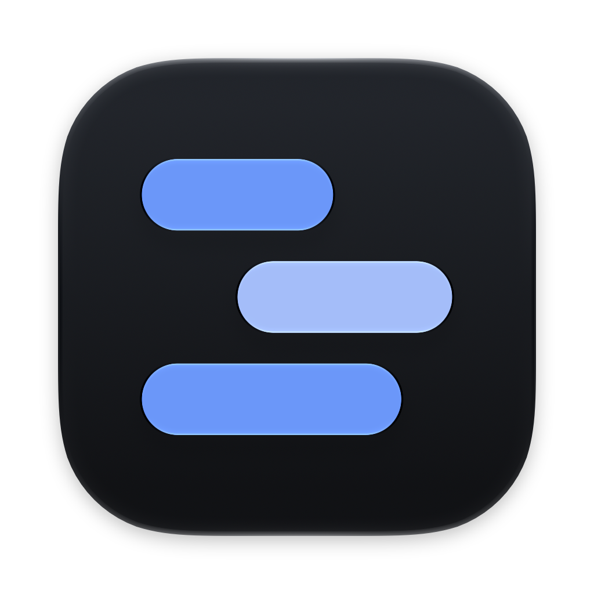
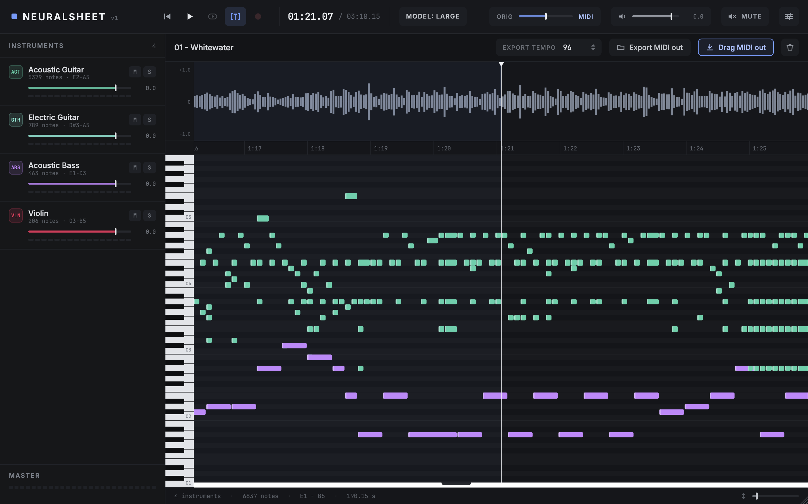

<p align="center"></p>

# NeuralSheet

**Audio-to-MIDI transcription as a native macOS app.** Record or drop a track, pick the instruments, and NeuralSheet turns it into MIDI you can play back, mix, and drag straight into your DAW. Transcription runs entirely on your machine.

NeuralSheet is a from-scratch Swift rewrite of [NeuralNote](https://github.com/DamRsn/NeuralNote) by [Damien Ronssin](https://github.com/DamRsn), built to fix the two things that held the original back on the Mac: audio latency and interface smoothness. It keeps NeuralNote's design, behaviour and transcription engine, and replaces the cross-platform C++/JUCE application layer with SwiftUI, AppKit and AVAudioEngine. See [Credits](#credits) for the full story.



> [!NOTE]
> **Status: v1.0 (September 2026).** NeuralSheet has feature parity with the NeuralNote v2 standalone app. Download the latest release from [neural-sheet.quassum.com](https://neural-sheet.quassum.com) or the [Releases page](https://github.com/bring-shrubbery/neural-sheet/releases/latest); it is signed and notarized. macOS 26 on Apple silicon only.

## What it does

- **Record or load audio.** Record from any input device, or drop a `.wav`, `.aiff`, `.flac`, `.mp3` or `.ogg` file onto the window.
- **Transcribe with MuScriptor.** A 100M to 1.4B parameter transformer from Kyutai and Mirelo, running locally on the GPU through Metal. Restrict it to the instruments you know are in the mix, or let it detect them.
- **Watch the notes arrive.** The piano roll fills in as each five-second chunk is decoded. You can start playing back the part that is done while the rest is still running.
- **Listen and mix.** Play the transcription through the built-in synthesizer, blend it with the original audio, and set the level, mute and solo of every instrument.
- **Edit the notes.** Switch to the Edit tab: move, resize, draw and erase notes, reassign them to other instruments, set velocities, snap and quantize to a tempo grid, with undo. Edits are saved with the session.
- **Get the MIDI out.** Drag the result onto a track in your DAW, or export a multi-track `.mid` file with one track per instrument.

## Why a rewrite

NeuralNote v2 is a JUCE application that also ships as an AU and VST3 plugin. That portability costs it on macOS: the audio path adds latency, and the fixed-size UI redraws far more than it needs to. NeuralSheet is macOS-only by design and uses the platform directly:

- **Audio** goes through one `AVAudioEngine` graph. A source node owns the clock and schedules synth notes one buffer ahead, sample-aligned with the original audio, with a 128-frame I/O buffer where the device allows it.
- **Drawing** is done by AppKit views that repaint only the strip that changed. The playhead and progress washes are layers that move without redrawing. A ten-minute file scrolls at 120 Hz.
- **Everything else** is SwiftUI, with the original palette, typography, metrics and interaction rules ported one for one.

The transcription engine itself, [muscriptor.cpp](https://github.com/DamRsn/muscriptor.cpp), is unchanged and linked as a static library.

## Usage

1. **Get some audio.** Press record (or `r`) and play, or drop a file on the waveform area. Choose your input and output devices in the **Audio** menu.
2. **Choose instruments.** Use **+** in the sidebar to tick the instruments in the recording, or leave it on *Automatic*. Transcriptions are better when the model is told what to listen for.
3. **Transcribe.** The first run downloads a model (see below). Progress shows in the status bar; you can cancel at any time.
4. **Listen.** Space plays and pauses. The **ORIG / MIDI** slider blends the source audio with the synthesized notes; each instrument has its own fader, mute and solo.
5. **Edit.** `⌘2` opens the Edit tab. `V` selects, `D` draws, `E` erases; drag notes, or their ends; `⌥`-drag duplicates; arrows nudge. Set the tempo and where bar 1 falls in the toolbar.
6. **Export.** Drag the **MIDI** button onto a track in your DAW, or use **Export** to save a `.mid` file. The export tempo sets how seconds map to beats.

Shortcuts: `Space` play/pause · `Shift+Space` go to start · `r` record · `m` mute · `c` centre the playhead · `Shift+Backspace` clear · `⌘`+scroll or pinch to zoom the timeline · `⌘1`/`⌘2` tabs · `⌘Z` undo · `⌘U` quantize · `⌘A` select all · `⌘`-drag ignores snap.

## Models

MuScriptor comes in three sizes. NeuralSheet downloads them from [DamRsn/muscriptor-gguf](https://huggingface.co/DamRsn/muscriptor-gguf) on Hugging Face into `~/Library/NeuralSheet/models` (it also picks up models already in `~/Library/NeuralNote/models`). Downloads resume if interrupted and are verified by SHA-256.

| Size | Download | Speed on an M1 Pro (Metal) | Notes |
|---|---|---|---|
| small | 209 MB | ~3.5× real time | Fastest |
| medium | 618 MB | ~1.5× real time | Recommended |
| large | 2.7 GB | ~0.5× real time | Best quality |

> [!IMPORTANT]
> **The model weights are not open source.** Kyutai and Mirelo released them under [CC BY-NC 4.0](https://creativecommons.org/licenses/by-nc/4.0/): they may only be used **non-commercially**. NeuralSheet's own code is Apache-2.0, which does not extend to the weights.

Playback uses the General MIDI synthesizer built into macOS, so no soundfont is bundled. It sounds different from NeuralNote's MuseScore soundfont.

## Build from source

Requirements:

- macOS 26 on Apple silicon, Xcode 27
- [CMake](https://cmake.org/) (`brew install cmake`), used to build the transcription engine
- Internet access on the first build (the engine fetches [ggml](https://github.com/ggml-org/ggml))

```sh
git clone --recurse-submodules https://github.com/bring-shrubbery/neural-sheet.git
cd neural-sheet/app
xcodebuild -scheme NeuralSheet -configuration Release build
```

Or open `app/NeuralSheet.xcodeproj` in Xcode and run the **NeuralSheet** scheme. A build phase compiles the engine with CMake on first build and skips it afterwards. The app is signed for development with the hardened runtime and the microphone entitlement; to distribute it you need your own Developer ID.

The pure-Swift logic lives in a package with its own tests:

```sh
cd app/Packages/NeuralSheetCore && swift test
```

## Repository layout

```
app/          The macOS app: Xcode project, Swift package, engine submodule, build scripts
docs/design/  How the app was built: the behavioural inventory of NeuralNote, the design, the plan, the parity pass
web/          The website (Astro), deployed to neural-sheet.quassum.com by Cloudflare Workers Builds
```

## Contributing

NeuralSheet is developed by a small team working with AI coding agents that we run and supervise ourselves. Because of that:

- **Feature requests, ideas and questions** go to [Discussions](https://github.com/bring-shrubbery/neural-sheet/discussions). The most requested and best argued ideas are what we build next.
- **Bug reports** go to [Issues](https://github.com/bring-shrubbery/neural-sheet/issues), using the template, for bugs you have reproduced yourself.
- **Pull requests are not accepted** and are closed automatically.

[CONTRIBUTING.md](CONTRIBUTING.md) explains the reasoning and the details.

## Roadmap

- UX improvements beyond parity: this is where v2 starts
- MIDI out to other apps with per-instrument channels
- Universal builds

## Credits

NeuralSheet started on **2026-09-17** as a rewrite of **NeuralNote v2** at commit [`20ca45a`](https://github.com/DamRsn/NeuralNote/commit/20ca45a). Everything a user sees, and the audio and MIDI logic underneath, follows NeuralNote's design; the Swift code was written new against a detailed [inventory of its behaviour](docs/design/2026-09-17-neuralnote-feature-inventory.md), and the note scheduler, resampler, waveform peaks, MIDI writer and piano-roll geometry are ports of the original C++.

- **NeuralNote v2** was developed by [Damien Ronssin](https://github.com/DamRsn), with AI assistance.
- **NeuralNote v1** was developed by Damien Ronssin and [Tibor Vass](https://github.com/tiborvass); its interface was designed by Perrine Morel.
- **muscriptor.cpp**, the transcription engine, is by Damien Ronssin. **MuScriptor**, the model, is by Kyutai and Mirelo ([paper](https://arxiv.org/abs/2607.08168), [project](https://github.com/muscriptor/muscriptor)).
- **NeuralSheet** is by [Antoni Silvestrovic](https://github.com/bring-shrubbery), built with Claude Code.

## License

NeuralSheet's code is licensed under the [Apache License 2.0](LICENSE), the same licence as NeuralNote. [NOTICE](NOTICE) records the origin of the work, and [THIRD_PARTY_NOTICES.md](THIRD_PARTY_NOTICES.md) lists every third-party component: muscriptor.cpp and ggml (MIT), PFFFT (BSD-style), stb_vorbis (public domain), and the Inter and JetBrains Mono typefaces (OFL 1.1).

The MuScriptor model weights are **CC BY-NC 4.0, non-commercial use only**, and are downloaded separately at run time.
